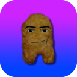
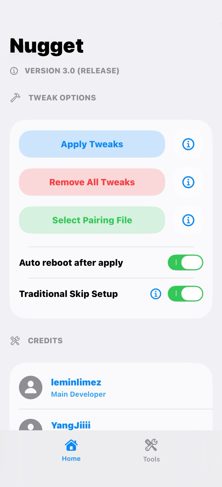

# Nugget-(Mobile)-26
As you know, Nugget mobile is outdated so only works on iOS 18 but, with this fan project you can inject your nugget favorite tweaks using just your iPhone/iPad in iOS 26 ¡That sounds easy! ¡With this project we make nugget back to life and make your iDevice better! ¿Are you ready?
# Presentation
Unlock your device's full potential! Should work on all versions iOS 18.0 - 26.2 developer beta 1

This will not work on iOS 26.2 beta 2 or newer. Please do not make issues about this, it will not be fixed. You will have to use the pc version of Nugget unless a fix comes in the future.

A .mobiledevicepairing file and localdevvpn are required in order to use this. Read the sections below to see how to get those.

If you are having issues with minimuxer, see the Solving Minimuxer Issues thread.

This uses the bookrestore exploit to write to files outside of the intended restore location, like mobilegestalt.

Note: I am not responsible if your device bootloops, use this software with caution. Please back up your data before using!

